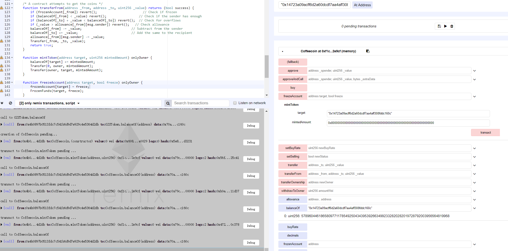
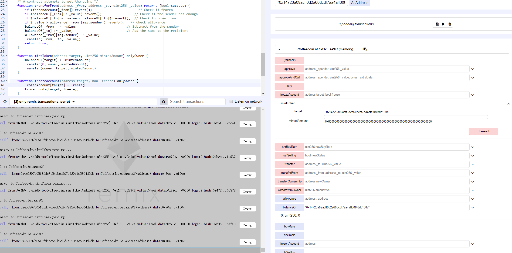

### Coffeecoin


https://etherscan.io/address/0x9d5bd53fc23d6485a80b9879097e67a797365ca5#code


```javascript
    function mintToken(address target, uint256 mintedAmount) onlyOwner {
        balanceOf[target] += mintedAmount;
        Transfer(0, owner, mintedAmount);
        Transfer(owner, target, mintedAmount);
    }
```


The Coffeecoin token could be arbitrary minted by its creator in function mintToken(). The balanceOf[target] and mintedAmount are a defined as uint, so oprator '+' would definitely result in an integer overflow.


Simulated on Remix:



The owner of the contract could mintToken arbitary amout of (for example 0x8000000000000000000000000000000000000000000000000000000000000000 Wei) subconcurrency Coffeecoin to an arbitary user.





If the owner of the contract mintToken another 0x8000000000000000000000000000000000000000000000000000000000000000 Coffeecoin to the user again,  integer overflow happened which make balanceOf this user to be 0.

And actually the owner of the contract could control the balance of an arbitary user to be an aribitary value. 


 
