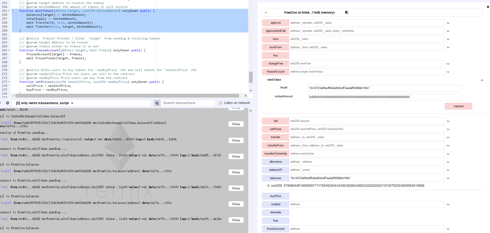
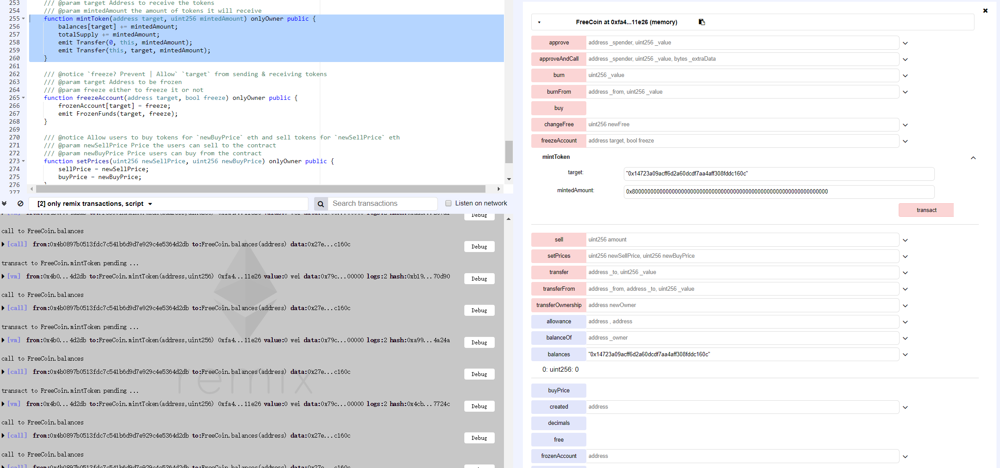

### FreeCoin


https://etherscan.io/address/0xfdea2ad97ec5297090c8d945f25a15f17f4c283d#code


```javascript
    function mintToken(address target, uint256 mintedAmount) onlyOwner public {
        balances[target] += mintedAmount;
        totalSupply += mintedAmount;
        emit Transfer(0, this, mintedAmount);
        emit Transfer(this, target, mintedAmount);
    }

```


The FreeCoin token could be arbitrary minted by its creator in function mintToken(). The balanceOf[target] and mintedAmount are a defined as uint, so oprator '+' would definitely result in an integer overflow.


Simulated on Remix:



The owner of the contract could mintToken arbitary amout of (for example 0x8000000000000000000000000000000000000000000000000000000000000000 Wei) subconcurrency FreeCoin to an arbitary user.





If the owner of the contract mintToken another 0x8000000000000000000000000000000000000000000000000000000000000000 FreeCoin to the user again,  integer overflow happened which make balanceOf this user to be 0.

And actually the owner of the contract could control the balance of an arbitary user to be an aribitary value. 


 
